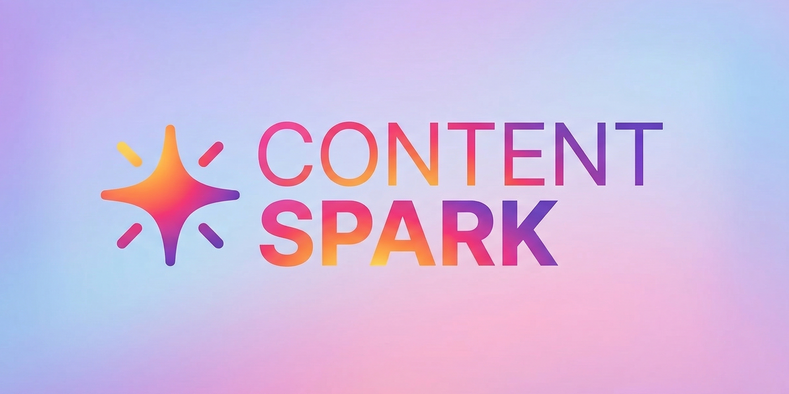

<p align="center">
  
</p>

<p align="center">
  Plataforma SaaS para creadores de contenido: RAG, agentes inteligentes y planificación de contenido accionable.
</p>

## ContentSpark

ContentSpark evolucionó de una herramienta RAG local a una **plataforma SaaS completa** para asistir a creadores de contenido. Combina recuperación semántica (RAG), generación asistida por IA y agentes conversacionales para ofrecer respuestas útiles y contextualizadas al perfil de cada creador, además de generar calendarios de contenido sincronizados con Google Calendar.

## Objetivo del proyecto

Los creadores de contenido muchas veces sufren por falta de consistencia, pérdida del conocimiento consumido y desconexión entre estrategia y ejecución. 
ContentSpark resuelve esto ofreciendo:
1. **Chat con RAG personalizado:** Centraliza el conocimiento y responde inyectando el contexto específico del perfil del creador.
2. **Onboarding inteligente (Agent):** Un agente interactivo perfila al creador (nicho, audiencia, objetivos).
3. **Calendarización accionable:** Transforma ideas en un plan de publicación directamente sincronizado con herramientas externas.

## Stack tecnológico

### Frontend (Next.js App)
- **Framework:** Next.js 16 (App Router)
- **UI:** React 19 + TypeScript + Tailwind CSS 4
- **Diseño:** Glassmorphism (Apple/Liquid Glass)
- **Auth:** Supabase Auth (Email/Pass + Google OAuth)

### Backend (FastAPI)
- **Framework:** FastAPI + Uvicorn + Python 3.10+
- **Agent Orchestration:** LangGraph (Agentes de onboarding y planificación)
- **LLM:** Groq (Llama 3.1 8B) 
- **Embeddings:** Google Gemini (`gemini-embedding-001`)

### Base de datos & Integraciones
- **Relacional:** PostgreSQL vía Supabase + Prisma ORM
- **Vectorial:** Qdrant Cloud (búsqueda semántica, colecciones RAG)
- **Automatización:** n8n (Google Calendar y Gmail)

## Arquitectura y Módulos Principales

1. **Gestión de Usuarios & Auth:** Flujo seguro con Supabase + persistencia en DB relacional vía Prisma.
2. **Onboarding Inteligente:** Agente (LangGraph) que conversa para extraer el *CreatorProfile* (nicho, tono, formatos).
3. **Flujo CRAG Optimizado:** Búsqueda en Qdrant con query rewriting, filtrado por score y enriquecimiento de prompt.
4. **Calendario de Contenido:** Generación de contenido con LLM en base a prioridades y exportación mediante webhooks a n8n.

## Estructura del repositorio

```text
ContentSpark/
├── CLAUDE.md / CONTENTSPARK_SAAS_ROADMAP.md # Documentación interna y roadmap
├── backend/
│   ├── main.py
│   ├── ingest_data.py          # Pipeline de ingesta optimizado (PDF/URLs)
│   ├── app/
│   │   ├── agents/             # Agentes LangGraph (onboarding, calendar)
│   │   ├── routers/            # Endpoints API segregados (auth, chat, ...)
│   │   ├── services/           # Lógica de RAG, embeddings y DB vectorial
│   │   └── middleware/         # Auth y verificación de tokens
├── frontend/
│   ├── app/                    # Auth, App principal (Chat, Calendario, Perfil)
│   ├── components/             # Componentes modulares, UI, Markdown
│   ├── lib/                    # Supabase Client, Prisma, fetch APIs
│   └── prisma/                 # Schema PostgreSQL y migraciones
└── n8n/                        # Workflows configurados (próximos)
```

## Requisitos previos

- Python 3.10+ y Node.js 20+
- Instancia y API Keys de: **Groq**, **Google AI**, **Qdrant**, y **Supabase** (Auth/PostgreSQL).
- (Opcional) Instancia de n8n para webhooks de calendario.

## Variables de entorno

**Backend (`backend/.env`):**
```env
GROQ_API_KEY=...
GOOGLE_API_KEY=...
QDRANT_URL=...
QDRANT_API_KEY=...
SUPABASE_URL=...
SUPABASE_ANON_KEY=...
SUPABASE_SERVICE_ROLE_KEY=...
DATABASE_URL=postgresql://...
SUPABASE_JWT_SECRET=...
N8N_WEBHOOK_URL=...
```

**Frontend (`frontend/.env.local`):**
```env
NEXT_PUBLIC_SUPABASE_URL=...
NEXT_PUBLIC_SUPABASE_ANON_KEY=...
NEXT_PUBLIC_API_URL=http://localhost:8000
```

## Instalación y ejecución

### 1) DB & ORM (Desde el frontend)
```bash
cd frontend
npm install
npx prisma generate
npx prisma migrate dev
```

### 2) Backend
```bash
cd backend
pip install -r requirements.txt
uvicorn main:app --reload --host 0.0.0.0 --port 8000
```

### 3) Frontend
```bash
cd frontend
npm run dev
```
(La app operará en *localhost:3000* y la API en *localhost:8000*).

## Ingesta de Documentos
El nuevo script de ingesta procesa tanto PDFs como URLs y añade metadatos para optimizar los chunks.

```bash
cd backend
python ingest_data.py all
```
*(Usa `python ingest_data.py --help` para ver más opciones como `urls`, `pdfs` o ver `stats`)*

## Roadmap del Proyecto (SaaS)

El estado del proyecto sigue el siguiente plan:
- ✅ **Fase 0:** Setup de Infraestructura (Prisma, Supabase, Qdrant, Estructura).
- 🔄 **Fase 1:** Auth + Multi-chat (Integración Supabase, Historial DB).
- 🔜 **Fase 2:** Onboarding Inteligente (Agente LangGraph para perfiles).
- 🔜 **Fase 3:** Calendario de Contenido y Generación Asistida.
- 🔜 **Fase 4:** Integración n8n (Google Calendar + Gmail).

Para más detalles, consulta el documento estratégico `CONTENTSPARK_SAAS_ROADMAP.md`.
